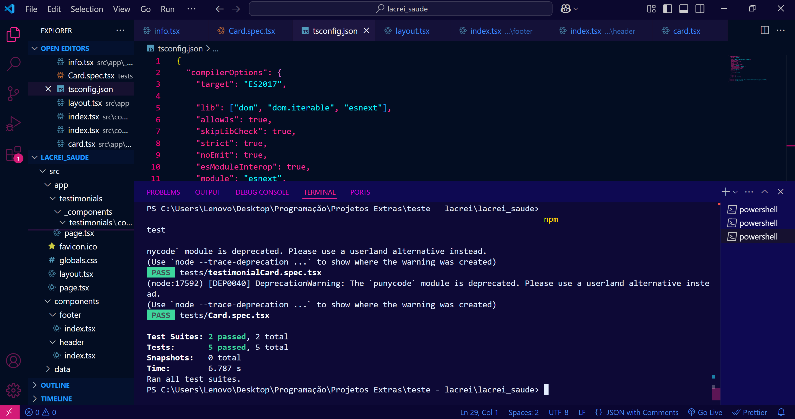

# Desafio Técnico - Lacrei Saúde

## 📌 Objetivos do Projeto

Este projeto foi desenvolvido como parte do desafio técnico da Lacrei Saúde para a vaga voluntária de desenvolvedor(a) front-end.

O objetivo é criar um website responsivo utilizando Next.js e TypeScript, com duas páginas interativas, componentes reutilizáveis e botões funcionais que redirecionam para outras páginas do site original da Lacrei Saúde.

## 📌 Funcionalidades Implementadas

✔️ Header e Footer personalizados alinhados à identidade da Lacrei Saúde
✔️ Duas páginas interativas com roteamento
✔️ Três botões funcionais redirecionando para páginas da Lacrei Saúde
✔️ Estilização responsiva utilizando Styled-Components e Tailwind CSS
✔️ Testes unitários com Jest garantindo a qualidade do código
✔️ Deploy na Vercel para acesso fácil

## 📌 Tecnologias

Este projeto foi desenvolvido com as seguintes tecnologias:

- Next.js - Framework React para desenvolvimento web moderno

- TypeScript - Superset do JavaScript para tipagem estática

- Styled-Components - Biblioteca para estilização com CSS-in-JS

- Tailwind CSS - Framework utilitário para estilização rápida e responsiva

- Jest - Framework para testes unitários

        

📦 Dependências adicionais:

- React Icons - Biblioteca de ícones para React

- ESLint & Prettier - Ferramentas para padronização e qualidade do código

## 📌 Como rodar o projeto

Para rodar o projeto localmente, siga os passos abaixo:

✔️ Clone o repositório

git clone [copie o link do repositório]
cd seu-repositorio

✔️ Instale as dependências

npm install
ou
yarn install

✔️ Inicie o servidor de desenvolvimento

npm run dev
ou
yarn dev

✔️ Acesse no navegador

O projeto estará rodando em:
👉 http://localhost:3000

## 📌 Como Realizar o Build e Deploy

✔️ Para gerar o build do projeto localmente, execute:

npm run build
ou
yarn build

✔️ Para realizar o deploy na Vercel:

versel

## 📌 Testes Unitários

✔️ Teste 1: verifica se o cartão exibe corretamente as informações passadas via props.

✔️ Teste 2: verifica se o carrossel exibe corretamente os depoimentos

📊 Registro da Aprovação dos Testes

✅ Todos os testes foram executados com sucesso:

  

## 📌 Deploy Online

A aplicação está disponível em:
